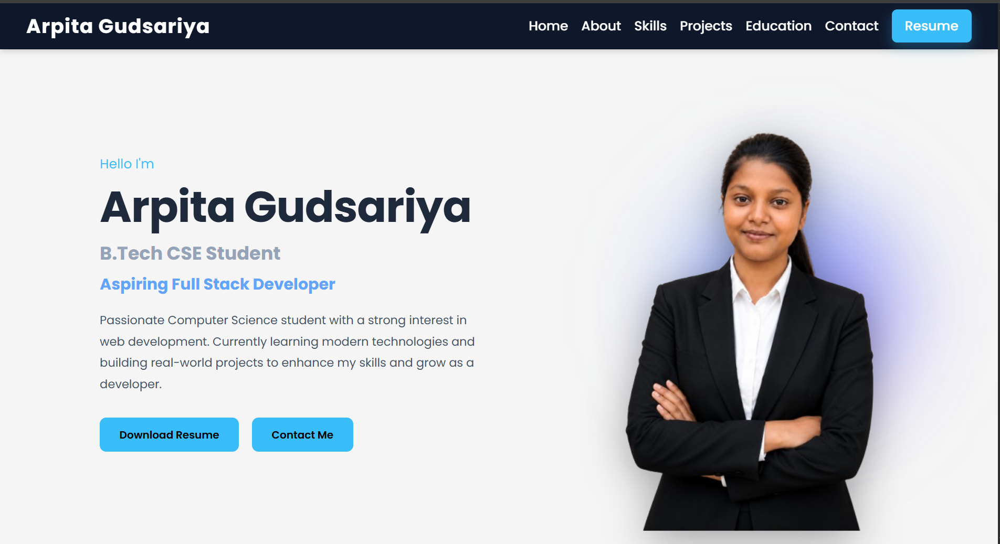

# 🌐 Personal Portfolio Website

A modern, responsive and clean personal portfolio website built using **HTML5** and **CSS3**. This project showcases my skills, education, projects, and resume in a professional way.

---

## 🚀 Live Demo

🔗 **Website:** https://arpita-gudsariya.github.io/CODSOFT_TASK1_Portfolio/

---

## 📸 Portfolio Preview



---

## ✨ Features

- 💻 Fully Responsive Design
- 🎨 Modern UI Design
- 👩‍💻 About Me Section
- 🛠️ Technical Skills
- 📂 Projects Showcase
- 🎓 Education Section
- 📄 Resume Preview
- ⬇️ Resume Download
- 📞 Contact Section

---

## 🛠️ Technologies Used

- HTML5
- CSS3
- Font Awesome
- Google Fonts

---

## 📂 Folder Structure

```text
CODSOFT_TASK1_Portfolio/
│
├── assets/
│   └── portfolio-home.png
│
├── image/
├── resume/
├── index.html
├── style.css
└── README.md
```

---

## 💡 What I Learned

- Creating responsive layouts using HTML & CSS
- Building a professional portfolio website
- Using Git & GitHub for version control
- Deploying websites with GitHub Pages
- Organizing project structure

---

## 📬 Contact

- **GitHub:** https://github.com/Arpita-Gudsariya
- **LinkedIn:** https://www.linkedin.com/in/arpita-gudsariya-b36859347/

---

## 👩‍💻 Author

Arpita Gudsariya

Built with ❤️ as part of the **CodSoft Web Development Internship**.